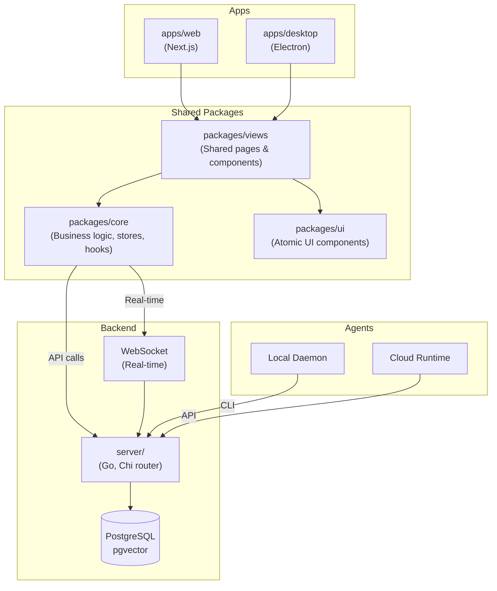
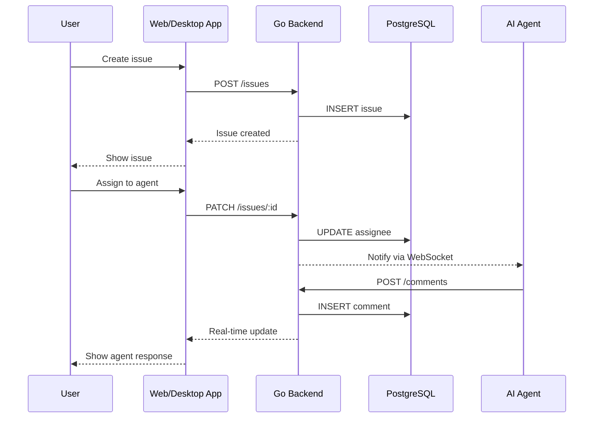

# Multica Architecture Overview

```mermaid
graph TB
    subgraph Apps
        Web["apps/web<br/>(Next.js)"]
        Desktop["apps/desktop<br/>(Electron)"]
    end

    subgraph Shared Packages
        Views["packages/views<br/>(Shared pages & components)"]
        Core["packages/core<br/>(Business logic, stores, hooks)"]
        UI["packages/ui<br/>(Atomic UI components)"]
    end

    subgraph Backend
        Server["server/<br/>(Go, Chi router)"]
        DB[(PostgreSQL<br/>pgvector)]
        WS["WebSocket<br/>(Real-time)"]
    end

    subgraph Agents
        Local["Local Daemon"]
        Cloud["Cloud Runtime"]
    end

    Web --> Views
    Desktop --> Views
    Views --> Core
    Views --> UI
    Core -->|API calls| Server
    Core -->|Real-time| WS
    Server --> DB
    WS --> Server
    Local -->|CLI| Server
    Cloud -->|API| Server
```

```mermaid
sequenceDiagram
    participant U as User
    participant App as Web/Desktop App
    participant API as Go Backend
    participant DB as PostgreSQL
    participant Agent as AI Agent

    U->>App: Create issue
    App->>API: POST /issues
    API->>DB: INSERT issue
    API-->>App: Issue created
    App-->>U: Show issue

    U->>App: Assign to agent
    App->>API: PATCH /issues/:id
    API->>DB: UPDATE assignee
    API-->>Agent: Notify via WebSocket
    Agent->>API: POST /comments
    API->>DB: INSERT comment
    API-->>App: Real-time update
    App-->>U: Show agent response
```
